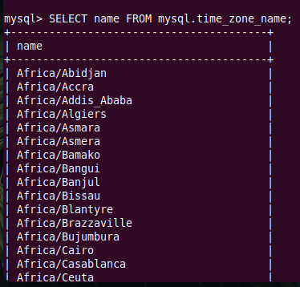
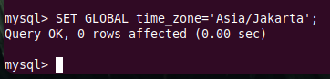

# MySQL
* Install mysql
```
sudo apt install mysql-server-8.0 mysql-client
```
* Masuk pada mysql
```
sudo mysql -u root -p
```
* Remote mysql
```
mysql -h <127.0.0.1> -u <user-mysql> -p
```
* Mengatasi koneksi error  
Ada kondisi kita mengalami error ketika akan mengakses mysql secara remote. Hal ini dikarenakan konfigurasi default mysql tidak mengijinkan mysql diakses secara remote.
> ERROR 2002 (HY000): Can't connect to local MySQL server through socket '/var/run/mysqld/mysqld.sock' (2)
Cara mengatasinya ubah file konfigurasi mysql `sudo nano /etc/mysql/mysql.conf.d/mysqld.cnf`, lalu ubah baris `bind-address`
```
bind-address           = 127.0.0.1
```
ubah jadi berikut:
```
bind-address           = 0.0.0.0
```
* Melihat user terdaftar. `harus masuk sebagai user root agar bisa melihat semua user`
```sql
select user,host,plugin from mysql.user;
```
* Melihat database
```sql
show databases;
```
* Membuat database
```sql
create database belajar_database;
```
* Membuat user
```sql
CREATE USER 'user1'@'%' IDENTIFIED BY 'rahasia';
```
* Memberikan akses salah satu database pada `user1`
```sql
GRANT ALL ON belajar-database.* TO 'user1'@'%';
FLUSH PRIVILEGES;
```
* Memberikan akses kesemua database pada `user1`
```sql
GRANT ALL ON *.* TO 'user1'@'%';
FLUSH PRIVILEGES;
```
* Membuat database barang
```sql
create database barang;
```
* Membuat tabel
```sql
SHOW TABLES;

CREATE TABLE barang (
    id      INT             NOT NULL,
    nama    VARCHAR(100)    NOT NULL,
    harga   INT             NOT NULL DEFALUT 0,
    jumlah  INT             NOT NULL DEFAULT 0
) ENGINE = InnoDB;
```
* Menampilkan tabel 
```sql
show tables;
```
* Menampilkan data pada table `barang`
```sql
select * from barang;
```
* Menampilkan deskripsi tabel `barang` 
```sql
DESCRIBE barang;

DESC barang

SHOW CREATE TABLE barang;
```
* Menambahkan kolom pada tabel `barang`
```sql
ALTER TABLE barang
    ADD COLUMN deskripsi TEXT;

ALTER TABLE barang
    ADD COLUMN salah TEXT;
```
* Menghapus kolom pada tabel `barang`
```sql
ALTER TABLE barang
    DROP COLUMN salah;
```
* Merubah kolom pada tabel `barang`
```sql
ALTER TABLE barang
    MODIFY nama VARCHAR(200) AFTER deskripsi;

ALTER TABLE barang
    MODIFY nama VARCHAR(200) FIRST;

ALTER TABLE barang
    ADD waktu_dibuat TIMESTAMP NOT NULL DEFAULT CURRENT_TIMESTAMP;
```
* Membuat data pada tabel `barang` - INSERT
```sql
INSERT INTO barang (id, nama, harga, jumlah) VALUES (01, 'Gula ABC', 5000, 5);

INSERT INTO barang (id, nama, harga, jumlah) VALUES (01, 'Kecap ABC', 3000, 15);

INSERT INTO barang (id, nama, harga, jumlah) VALUES (01, 'Bumbu ABC', 8000, 25);
```
* Mengubah data pada tabel `barang` - UPDATE
```sql
UPDATE barang SET id = 2 WHERE nama = 'Kecap ABC';

UPDATE barang SET id = 3 WHERE nama = 'Bumbu ABC';

UPDATE barang SET deskripsi = 'Kecap hitam manis' WHERE nama = 'Kecap ABC';
```
* Menghapus data pada table `barang` - DELETE
```sql
DELETE FROM barang WHERE nama = 'Kecap ABC';
```
## Mengubah Time Zone Datbase
Secara default time-zone pada database yang diinstal akan mengikuti system time-zone yaitu UTC. 
* Untuk melihat zona waktu yang digunakan bsia dengan menjalankan perintah berikut:
```sql
SELECT @@time_zone;
```
  

* Untuk melihat nama zona waktu bisa menjalankan perintah berikut:
```sql
SELECT name FROM mysql.time_zone_name;
```
  

* Lalu untuk mengatur zona waktu menjadi `Asia/Jakarta` dengan menjalankan perintah berikut:
```sql
SET GLOBAL time_zone='Asia/Jakarta';
```
  

* Setelah itu coba perikasa kembali apakah zona waktu sudah terganti, dengan menjalankan perintah berikut: 
```sql
SELECT @@time_zone;
```
  

> Jika zona waktu belum berganti menjadi `Asia/Jakarta` coba keluar dan login kembali pada user database dan jalankan kembali perintah `SELECT @@time_zone;`


---
https://www.techonthenet.com/mysql/grant_revoke.php

